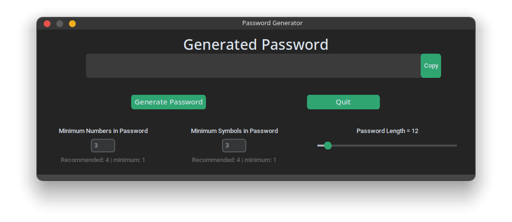
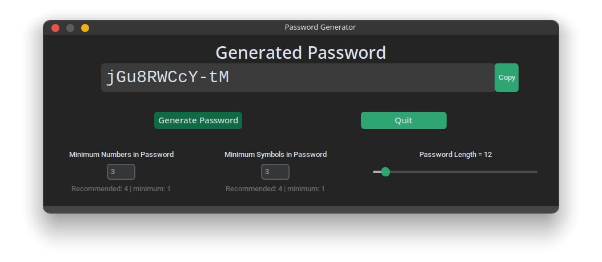
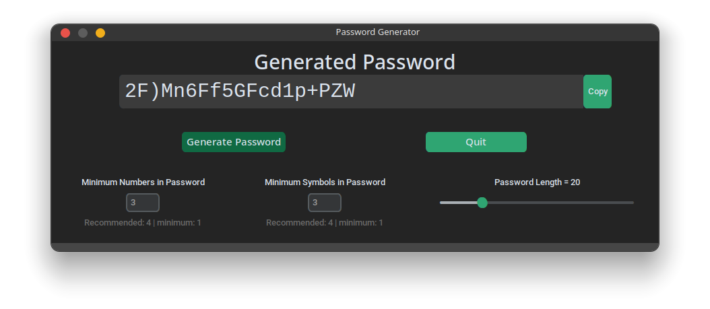
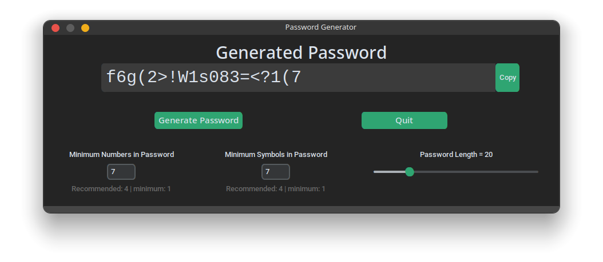
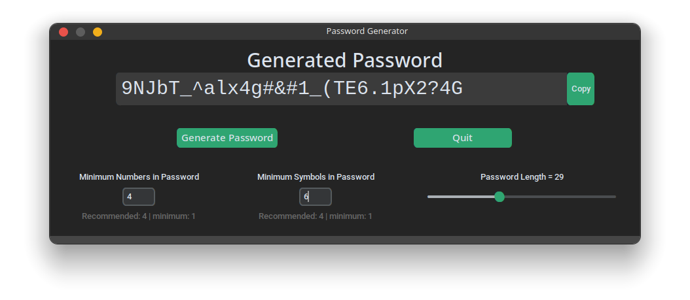
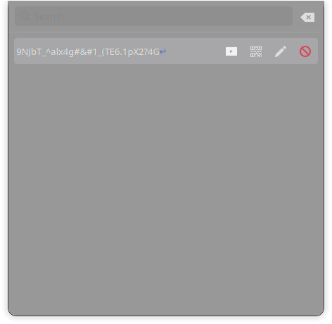

# CodeClause Random Password Generator

CodeClause Random Password Generator - This is a GUI Based Random Password Generator Application made using python and it's modules.

### Requirements:
- Python 3.6 or above
- Tkinter Module (Built-in)
- CustomTkinter Module
- Random Password Generator Module
- pyperclip Module

### How to use:
- Download the zip file and extract it.
- cd into unzipped folder directory
- run ```$ pip install -r requirements.txt```
- Run the main.py file.
- Enter the length of the password you want to generate.
- Click on the Generate Password button.
- Click on the Copy Password button to copy the password to your clipboard.
- Click on the Quit button to exit the application.

### Screenshots
UI Design:

Default Password Length:

Password Length Changed:

Password Length with custom Numbers and Symbols Length:

Password Copied to Clipboard:


